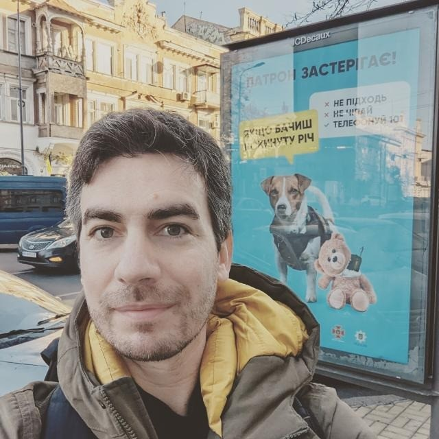
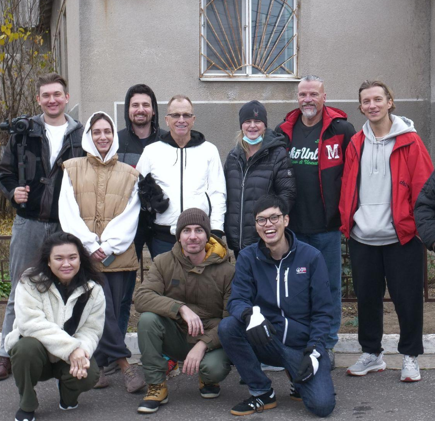
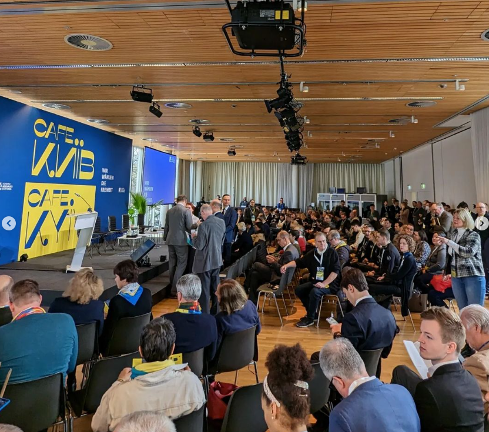
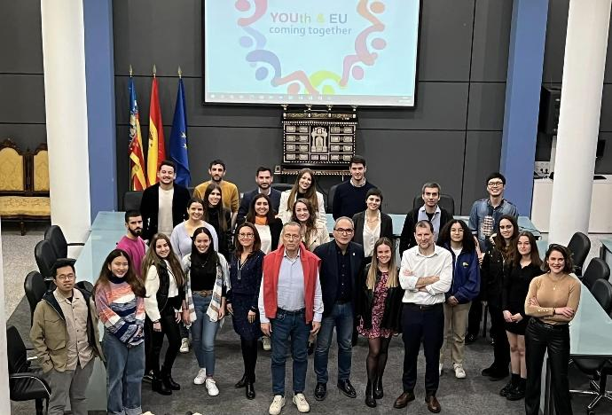
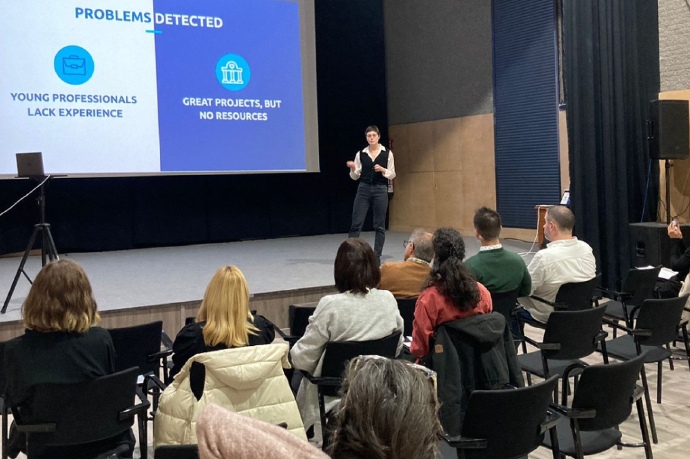
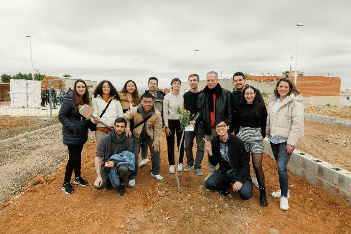
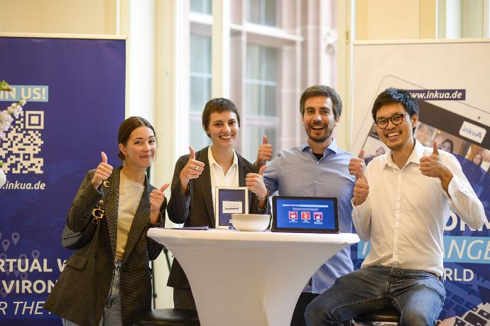
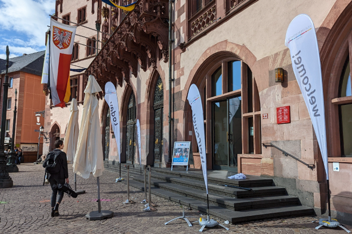
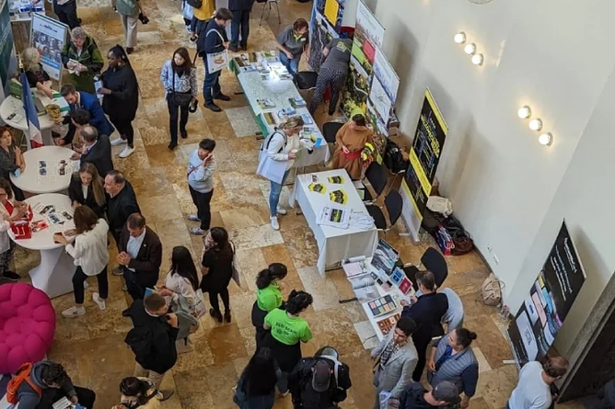

# 👉 The Team

## International Collective

InkuA is a collective organization with the input, help and advice of **hundreds of professionals, advisors, researchers, volunteers, etc. from all over the world.**

More than **100,000 work hours** were already invested by over **3,500 members** to get us to where we are. We are thankful to everyone.

## Founder

**Frank Escudero** - CEO

_German-Argentinean Entrepreneur and IT specialist. Participated in accelerator programs in Buenos Aires, Miami and Frankfurt, where he founded InkuA as an impact multiplier. He believes that **everyone has unlimited potential**._

<figure><figcaption>
Frank in Ukraine
</figcaption></figure>

## Co-Founders


Updating Co-founders profiles and roles.&#x20;


**Pilot:**

Fabian Nguyen

Milagros Corredera

Julia Bonsignore Pesci

**2022:**

Huong Vo

Daniel Twisselmann

**2023:**

Cosmina Florea

Iassana Minella

## Member Pictures

InkuA has members in more than 25 countries and did projects all over the world. Here are some pictures:

<figure><figcaption>
InkuA team in Ukraine with UA Relief
</figcaption></figure>

 

<figure><figcaption>
Fabian and Frank with Non-violent Peace for in Ukraine
</figcaption></figure>

 

<figure><figcaption>
Fabian in a distribution centre
</figcaption></figure>

 

<figure><figcaption>
InkuA in Berlin presenting Mission to Ukraine Project
</figcaption></figure>

<figure><figcaption>
Huong and Frank in Berlin
</figcaption></figure>

 

<figure><figcaption>
Daniel and Fabian in Berlin showcasing InkuA project
</figcaption></figure>

<figure><figcaption>
Frank talking in EU Commission event in Spain
</figcaption></figure>

 

<figure><figcaption>
Youth and EU event in Spain
</figcaption></figure>

 

<figure><figcaption>
Julia giving a talk in EU program "The Break" in Spain
</figcaption></figure>

 

<figure><figcaption>
Fabian, Julia and Frank planting trees in Spain.
</figcaption></figure>

<figure><figcaption>
Marina, Julia, Frank, Fabian in Frankfurt's "Newcomers Festival"
</figcaption></figure>

 

<figure><figcaption>
Online Presentation with several members
</figcaption></figure>

 

<figure><figcaption>
Newcomers Festival in Römer
</figcaption></figure>

 

<figure><figcaption>
Newcomers Festival from 2nd Floor
</figcaption></figure>

##
