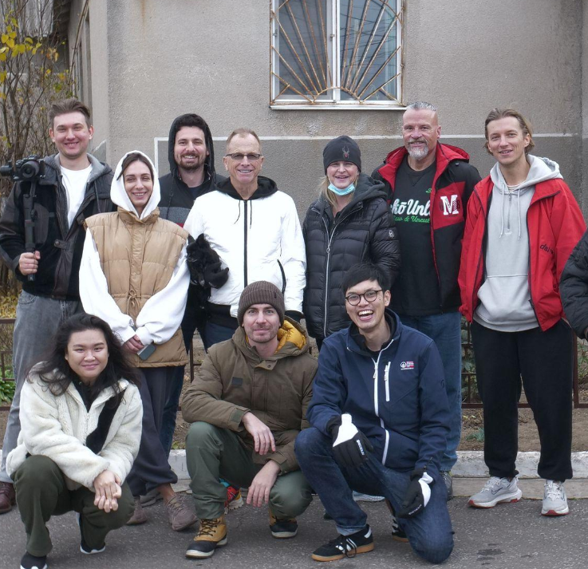
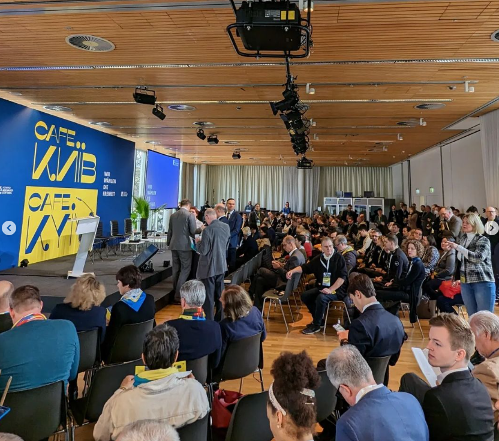
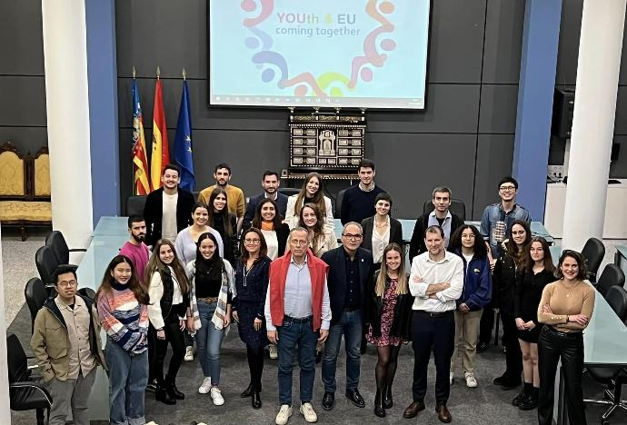
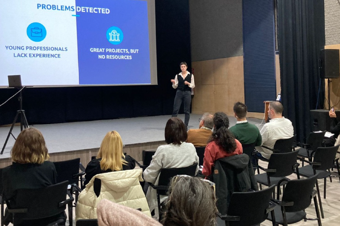
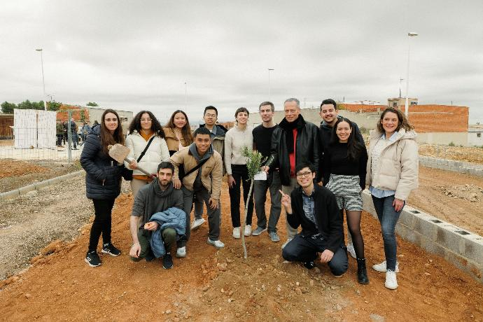
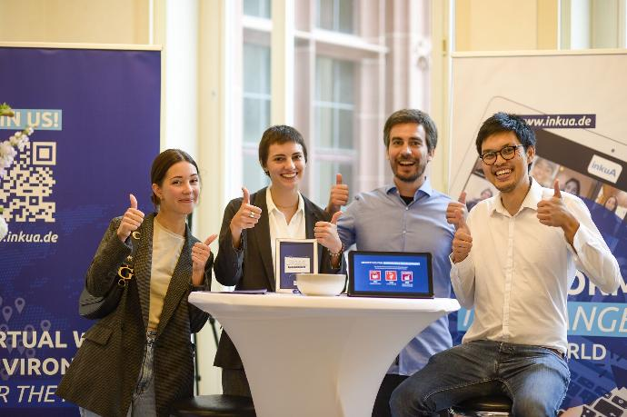
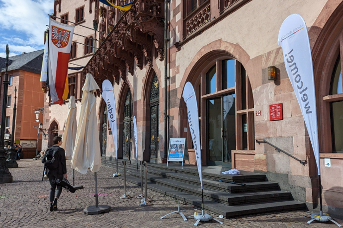

# 🌍 Meet the Team!

## Founder

&#x20;**Frank Escudero** - General Manager

_German-Argentinean Entrepreneur and IT specialist. Participated in accelerator programs in Buenos Aires, Miami and Frankfurt, where he founded InkuA to create an impact multiplier. Loves free and open education._&#x20;

<figure><figcaption>
Frank in Ukraine
</figcaption></figure>

## Co-Founders

**Pilot:**  Milagros Corredera, Julia Bonsignore Pesci. Fabian Nguyen.

**2022:** Huong Vo, Daniel Twisselmann.

**2023:** Cosmina Florea, Iassana Minella.

## Member Pictures

InkuA has members in more than 25 countries and did projects all over the world.&#x20;

<figure><figcaption>
InkuA team in Ukraine with UA Relief
</figcaption></figure>

 

<figure><figcaption>
Fabian and Frank with Non-violent Peace for in Ukraine
</figcaption></figure>

 

<figure><figcaption>
Fabian in a distribution centre
</figcaption></figure>

 

<figure><figcaption>
InkuA in Berlin presenting Mission to Ukraine Project
</figcaption></figure>

<figure><figcaption>
Huong and Frank in Berlin
</figcaption></figure>

 

<figure><figcaption>
Daniel and Fabian in Berlin showcasing InkuA project
</figcaption></figure>

<figure><figcaption>
Frank talking in EU Commission event in Spain
</figcaption></figure>

 

<figure><figcaption>
Youth and EU event in Spain
</figcaption></figure>

 

<figure><figcaption>
Julia giving a talk in EU program "The Break" in Spain
</figcaption></figure>

 

<figure><figcaption>
Fabian, Julia and Frank planting trees in Spain.
</figcaption></figure>

<figure><figcaption>
Marina, Julia, Frank, Fabian in Frankfurt's "Newcomers Festival"
</figcaption></figure>

 

<figure><figcaption>
Online Presentation with several members
</figcaption></figure>

 

<figure><figcaption>
Newcomers Festival in Römer
</figcaption></figure>

 

<figure><figcaption>
Newcomers Festival from 2nd Floor
</figcaption></figure>

##
